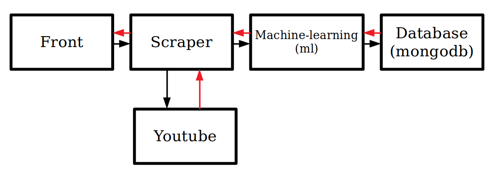

## Quick Start

__COMMANDES POUR RUN LE PROJET__

Au choix: 
```bash
# Lance un docker-compose up et import la base de données (durée estimée : 5mn)
sh start.sh 
```
 ou: 
```bash
# Run tout les dockers (non recommandé)
docker-compose up --build -d 
# importe la BDD
docker exec mongodb mongoimport --db yt_db --collection projet_cs --file data.json --jsonArray
```
pour arreter tout les process, simplement un
```bash
docker-compose down
```
pour relancer, vous pouvez aussi :
```bash
sh restart.sh 
```

Le front est ensuite accessible sur le port 5002 du localhost pour Linux, et de l'adresse 192.168.99.100 pour Windows avec DockerToolbox (adresse obtenue par la commande docker-machine ip default).

----------------
## Le fonctionnement
 
 en noir les requetes, en rouge les réponses
----------------

### Introduction
Le but de ce projet est de prédire le nombre de vues maximum d'une vidéo youtube (nombre qu'une vidéo atteint généralement en un mois) avec un modèle de machine learning entraîné sur une base de données Kaggle (https://www.kaggle.com/mfekadu/youtube-kaggle/data). L'utilisateur entre une URL de vidéo youtube via le front, et après quelques secondes le nombre de vues prédit est affiché.

###  1- Une BDD mongo

Un simple petit docker mongo, qui écoute sur son port 27017 (vous pouvez essayer de visualiser directement les data via ROBO3T si vous vous sentez aventureux). Les données sont écrites qu'une fois le docker pleinement lancé (on a eu quelques problèmes en essayant de faire des mongoimport *dans* le Dockerfile, d'où le docker exec mongodb ...).

Nous avons choisi d'utiliser mongo par sa simplicité d'utilisation et sa facilité d'accès par docker et python (via la bibliothèque pymongo).

Les données sont donc en format JSON:
```JSON
{
 "likes":11661,
 "dislikes":442,
 "ld_ratio":26.3227990971,
 "date":"2017-11-12T15:00:02.000Z",
 "genre":24,
 "is_title_all_caps":false,
 "views":301920
}
```

###  2- Un front

Le front envoie une requête au scraper (une requête post contenant l'URL de la vidéo youtube), et récupère la prédiction du nombre de vues. On a essayé de faire fonctionner angular (avec cli) dans un docker node mais npm boudait. (permissions *dans le docker* non accordée, puis les node_modules ne se faisaient pas au bon endroit dans le docker malgrés le WORKDIR, etc). Le front est donc pour le moment un ensemble d'application Flask en python avec un affichage en html+css.

----------------

*Les deux dockers suivants sont construits sur l'image python:3.7.2-slim, (alpine ne fonctionnait pas mais on voulait tout de même une version assez légère, avec python3 ).*

*Pour faire des modifications sur ces dockers, il suffit d'ajouter les nouvelles libs utilisées dans le requirements.txt du conteneur, et modifier (ou ajouter) les scripts python.*

----------------

###  3- Un scraper

Une fois l'URL recue, un programme de scraping récupère les données dont nous avons besoin. La bibliothèque BeautifulSoup4 en python est à notre connaissance la plus simple d'utilisation pour ce but.

Le scraper récupère plusieurs informations sur la vidéo youtube en question (toutes ne seront pas utilisées par l'algorithme de machine learning), allant du nombre de likes/dislikes à la durée de la vidéo.

###  4- Une partie Machine Learning

Elle utilise la LinearRegression de scikit-learn (toujours en python), ayant déjà travaillé avec cette librairie il était plus simple pour nous de l'utiliser.
Elle permet de prédire, à partir des données fournies de la BDD, le nombre de vues de la vidéo donnée par l'utilisateur.
Elle reçoit le JSON créé par le scraper, s'entraîne sur la BDD Mongo, puis renvoie le résultat, en ajoutant le json fourni par le scraper à la BDD si la vidéo a plus d'un mois.
